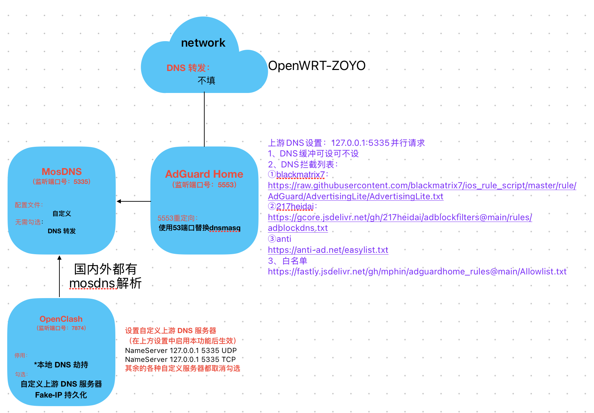

# 感谢 ✿✿ヽ(°▽°)ノ✿
[moreoronce/MosDNS-Config](https://github.com/moreoronce/MosDNS-Config) 作者！！！
----

根据 [moreoronce/MosDNS-Config](https://github.com/moreoronce/MosDNS-Config)  进行二次修改，因为[GeoData 导出]导出不了对应的geo文件只好使用手动导入，并更换了对应的目录,不然启动会覆盖原有的geo文件

[参考：deeprouter](https://deeprouter.org/article/OpenClash-Mosdns%E5%A6%82%E4%BD%95%E9%98%B2%E6%AD%A2DNS%E6%B3%84%E9%9C%B2%EF%BC%9F)

本配置需要使用的服务端口如下，有变动的自行修改：
|服务名|协议|端口号|备注|
|---|---|---|---|
|Openclash|DNS|7874|我没有用mosdns下发给clash|
|dnsmasq|DNS|5553|服务端口[被Adguardhome替换了|
|MosDNS|API|9091||
|MosDNS|DNS|5335||
|Adguardhome|DNS|53|5553重定向:使用53端口替换dnsmasq，所以dnsmasq端口就是5553了|

# 我的模式流程图：

- config1/2

- config3

# 自用MosDNS配置

- 支持ECS
- 支持GEOIP
- 支持GEOSITE
- 支持自定义灰名单及白名单
- 支持广告过滤
- 支持数据导入Grafana
- 本层级DNS处理无泄漏

# 使用方法

配置文件共计**3**个，分别为`config_custom.yaml`, `dns.yaml`, `dat_exec.yaml` 。

各部分作用如下：

- `config_custom.yaml`: 主配置文件，负责DNS序列定义以及DNS序列执行。需要依赖`dns.yaml`和`dat_exec.yaml`运行。
- `dns.yaml`: dns定义配置文件，负责配置公共DNS服务器及远端解析DNS地址及端口。
- `dat_exec.yaml`: 规则配置文件，负责定义各规则tag及规则来源文件。

下载或克隆三个yaml文件，OpenWRT放到`/etc/mosdns`文件夹内。如果是luci-app-mosdns，需要选择使用自定义配置文件。其他系统可以通过`-c` 参数指定配置文件为`config_custom.yaml` 。

默认GeoSite和GeoIP的存放位置为`/etc/mosdns/geo/` ,请确保文件夹下含有`geoip_cn.txt`、`geosite_category-ads-all.txt`、`geosite_geolocation-!cn.txt`、`geosite_gfw.txt`、`geosite_cn.txt`以及`geoip_private.txt` ，OpenWRT用户可以通过luci-app-mosdns的GeoData Export功能自动下载解码生成。
同时，在/etc/mosdns/下需要建立rule文件夹，并新建whitelist.txt和greylist.txt文件，用于自定义白名单和污染域名名单。DDNS类域名可放到白名单中。

# DNS处理流程：

教程及DNS处理队列详解：[自用MosDNS规则分享](https://deeprouter.org/article/mosdns-config-with-no-leak)

### 查询DNS泄露的网站
https://ipleak.net/

https://www.dnsleaktest.com/

https://browserleaks.com/dns

https://www.browserscan.net/
